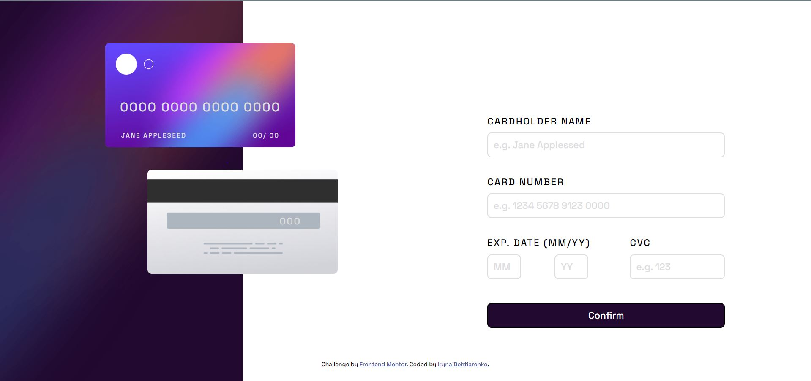

# Frontend Mentor - Interactive card details form solution

This is a solution to the [Interactive card details form challenge on Frontend Mentor](https://www.frontendmentor.io/challenges/interactive-card-details-form-XpS8cKZDWw). Frontend Mentor challenges help you improve your coding skills by building realistic projects.

## Table of contents

- [Overview](#overview)
  - [The challenge](#the-challenge)
  - [Screenshot](#screenshot)
  - [Links](#links)
- [My process](#my-process)
  - [Built with](#built-with)
  - [Continued development](#continued-development)
  - [Useful resources](#useful-resources)
- [Author](#author)

## Overview

### The challenge

Users should be able to:

- Fill in the form and see the card details update in real-time
- Receive error messages when the form is submitted if:
  - Any input field is empty
  - The card number, expiry date, or CVC fields are in the wrong format
- View the optimal layout depending on their device's screen size
- See hover, active, and focus states for interactive elements on the page

### Screenshot

Here is the screenshot of my desktop version

Here is the screenshot of my desktop version

### Links

- The Github solution URL: [my solution URL here](https://github.com/Irina-Dehtiarenko/Interactive_card_details_form__from_frontendMentor)

- Live Site URL: [My live site URL here](https://irina-dehtiarenko.github.io/Interactive_card_details_form__from_frontendMentor/)

## My process

### Built with

- Semantic HTML5 markup
- CSS custom properties
- Flexbox
- JS

### Continued development

I want to learn how to use some library.js(vanilla for example)
I want to learn how I can to make the credit card number input with spaces

### Useful resources

- [Developer Mozilla](https://developer.mozilla.org/en-US/) - This is a very helpful site really. Here ypu cat find everything about HTML, CSS, JS.

- [YouTube video 'JavaScript Client-side Form Validation'](https://www.youtube.com/watch?v=rsd4FNGTRBw&ab_channel=FlorinPop) - This is an amazing video which helped me understand how create an error function.

## Author

- Website in GitHub- [Iryna-Dehtiarenko](https://github.com/Irina-Dehtiarenko)
- Frontend Mentor - [@Irina-Dehtiarenko](https://www.frontendmentor.io/profile/Irina-Dehtiarenko)
- Email - [Iryna Dehtiarenko](iradegtjarenko@gmail.com)
